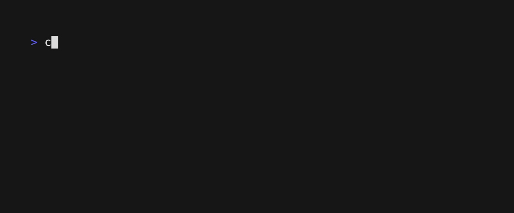

# Diceware

[](https://goreportcard.com/report/github.com/8ff/diceware)
[](https://godoc.org/github.com/8ff/diceware)
[](https://raw.githubusercontent.com/8ff/diceware/master/LICENSE)
[](https://github.com/<username>/<repository>/releases/latest)


Diceware is a technique for generating strong, memorable passwords using dice to select words from a list. The Diceware method is based on the idea that each word in the list corresponds to a unique combination of five dice rolls, making it difficult for attackers to guess the password.

## Diceware
The `diceware` library provided in this project allows you to generate diceware passwords using Go. The library includes functions for generating a list of words, a randomised list of words, and a map of words that corresponds to each possible combination of dice rolls.

### Example
```go
package main

import (
	"fmt"

	"github.com/8ff/diceware"
)

func main() {
	// Get a slice of words
	words := diceware.GetWords()
	fmt.Println("Number of entries:", len(words))

	// Get a randomised slice of words
	randomWords := diceware.GetRandomWords()
	fmt.Println("Number of entries in randomised list:", len(randomWords))

	// Get a map of words
	wordsMap := diceware.GetWordsMap()
	fmt.Println("Number of entries in words map:", len(wordsMap))
}
```

## Pwgen
The `pwgen` tool located in cmd/pwgen provided in this project allows you to generate diceware passwords using the command line.


## Generating passwords
To generate a diceware password using the pwgen command-line tool, you can run the go run command followed by the path to the pwgen package and any options you want to use. By default, pwgen will generate a 6-word diceware password.

You can specify a different password length by using the -l or --length option followed by a number. For example, to generate a 10-word diceware password, you can run the following command:

```bash
cd cmd/pwgen
go run main.go -l 10
```

The resulting password will be printed to the console.